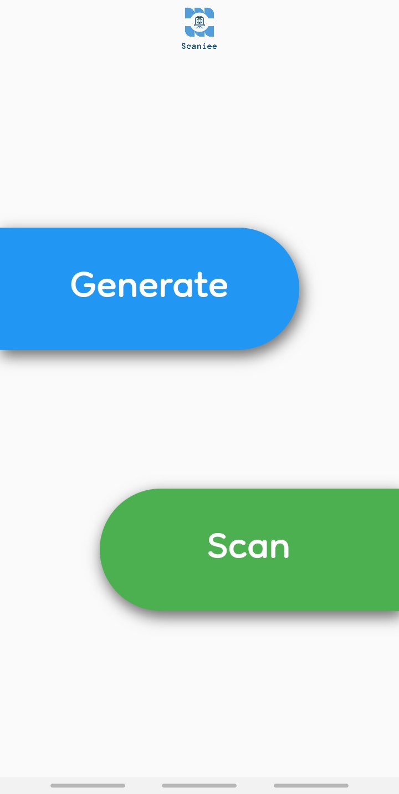
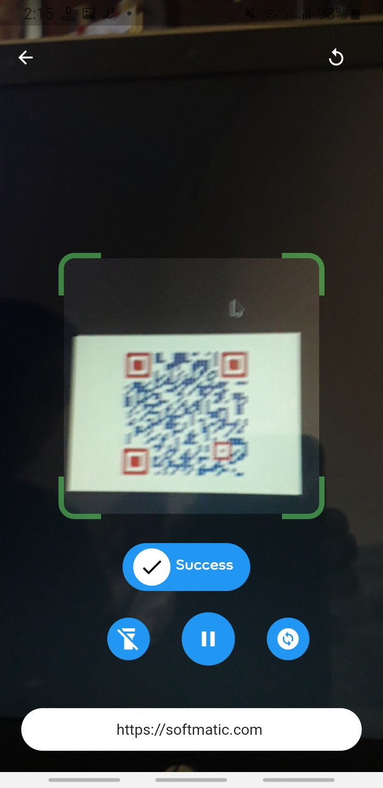

# Scaniee


**Scaniee** is QR code *Scanner* & *Generator* app. It is built entirely using *Flutter*. 

## Features
* [x]  Scan QR Code
  * [ ]  ▶️ Resume & Pause Scanning.
  * [ ] 🔦 Turn on & of Flash light.
  * [ ] 📸 Flip Camera.  <br>
* [x]  Generate QR Code
* [x]  Export QR Code


## Usage
### ⬇️ Download
Download the apk from [this](www.googledrive.com/kkd "this") link.

### 🏃 Run 
```bash
git clone www.github.com/itismrx/cseqr.git

cd cseqr

flutter run
```
## 📷️ Screenshot
|Home Screen|Genearte Screen|Export QR|
|--|--|----|
||||

|Scan Screen|Generated QR Code|
|---|---|
|||
